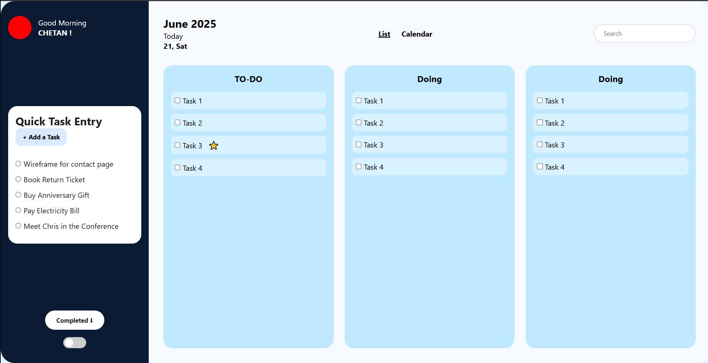

# 📝 To-Do Dashboard



A beautifully designed, interactive **To-Do Dashboard** that helps you manage tasks efficiently with a clean UI, responsive layout, and real-time task management features.

---

## 📚 Table of Contents

- [Features](#features)
- [Installation](#installation)
- [Usage](#usage)
- [Screenshots](#screenshots)
- [Contributing](#contributing)
- [License](#license)

---

## ✅ Features

- ✨ Modern UI with clean and responsive layout
- 📋 Sidebar for quick task entry
- 📅 Task board with columns for **To-Do**, **Doing**, and more
- 🔍 Built-in search functionality
- 🌙 Light/Dark mode toggle
- ➕ Add tasks dynamically with JavaScript
- 🖱️ Interactive controls and accessible navigation

---

## ⚙️ Installation

To get started with the **To-Do Dashboard**, follow these steps:

### 1. **Clone the repository**

```bash
git clone https://github.com/your-username/to-do-dashboard.git
cd to-do-dashboard
```
